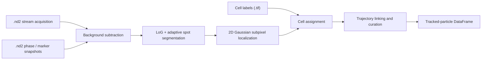

# sptPy


**Single-particle segmentation and tracking in live bacterial cells.**

sptPy detects diffraction-limited fluorescent particles in single-cell microscopy data, localizes them with subpixel precision, assigns them to segmented cells, and links them into trajectories. It operates directly on Nikon `.nd2` files (stream acquisitions and snapshots, e.g., as produced by the JOBS module in NIS-Elements) and on cell segmentation labels stored as `.tif` images.

The pipeline is orchestrated by the `particle_tracking` class, with each processing step also available as a standalone module.

Author: Alexandros Papagiannakis, HHMI at Stanford University (Christine Jacobs-Wagner lab), 2025

## Pipeline overview



1. **Image loading** ([nd2_to_array.py](nd2_to_array.py)) — converts `.nd2` files to numpy arrays via `pims`/`pims_nd2`, handling all channel/position/time-point iteration axes (`t`, `c`, `m`, `mc`, `mt`, `ct`, `mct`), and returns the metadata, pixel scale (μm/px), and sensor dimensions.
2. **Cell mask import** ([particle_tracking_for_GitHub.py](particle_tracking_for_GitHub.py)) — reads labeled cell masks (e.g., from a UNet), crops each cell with a pixel pad, and builds per-cell masks, meshes (contours), Shapely polygons, centroids, and areas. Cells touching the image edge are discarded, and cells previously flagged as badly segmented are excluded.
3. **Background correction** ([background_correction.py](background_correction.py)) — masks cell pixels using an Otsu threshold on the inverted phase-contrast image, estimates the cell-free background as the median fluorescence in square tiles (default 128 px), smooths it with a Gaussian filter, and subtracts it from the particle image while also correcting for uneven illumination.
4. **Particle segmentation** ([particle_segmentation.py](particle_segmentation.py), [custom_image_filters.py](custom_image_filters.py)) — segments spots with a combined Laplacian-of-Gaussian (hard percentile threshold) and adaptive local threshold filter. Spots are gated by area and aspect ratio; overly large or elongated spots are re-processed with a stricter local threshold to split clustered particles.
5. **Subpixel localization** ([twod_gaussian_fit.py](twod_gaussian_fit.py)) — fits a rotated 2D Gaussian (adapted from [Andrew Giessel's implementation](https://gist.github.com/andrewgiessel/6122739)) in a box around each spot centroid to estimate the particle center, amplitude, widths, rotation, and Gaussian volume (2π·A·σx·σy). Poorly constrained fits are rejected.
6. **Cell assignment** — each localized particle is assigned to the cell whose (dilated) polygon contains it; particles matching zero or multiple cells are left unassigned (`NaN`).
7. **Tracking and curation** ([particle_tracking_methods.py](particle_tracking_methods.py)) — links particles between frames by nearest-neighbor search within a maximum radius, gated by a fluorescence-ratio bandpass, with a memory parameter for transiently disappearing particles. Curation steps: removal of trajectories that merge to a common position, removal of spurious short trajectories, and connection of non-overlapping trajectory fragments that belong to the same cell.
8. **Drift estimation** ([image_drift.py](image_drift.py)) — estimates subpixel image drift between the phase-contrast snapshots taken before and after the stream acquisition by phase cross-correlation ([Guizar-Sicairos et al., 2008](https://doi.org/10.1364/OL.33.000156)).
9. **Cell coordinates** ([Bivariate_medial_axis_estimation.py](Bivariate_medial_axis_estimation.py)) — constructs the medial axis of single cells from the distance transform of the (10× upsampled) cell mask and projects cell pixels onto it, yielding relative 1D coordinates from pole to pole. *A second class that inherits from `particle_tracking` and projects trajectories onto these relative cell coordinates is coming soon.*

## Repository contents

| File | Description |
| --- | --- |
| [particle_tracking_for_GitHub.py](particle_tracking_for_GitHub.py) | The `particle_tracking` class — main entry point orchestrating the full pipeline |
| [particle_segmentation.py](particle_segmentation.py) | Spot segmentation and interactive parameter testing |
| [particle_tracking_methods.py](particle_tracking_methods.py) | Trajectory linking and curation functions |
| [twod_gaussian_fit.py](twod_gaussian_fit.py) | Rotated 2D Gaussian fitting for subpixel localization and spot intensity metrics |
| [background_correction.py](background_correction.py) | Cell-free background estimation and subtraction |
| [custom_image_filters.py](custom_image_filters.py) | Combined LoG / adaptive threshold filter |
| [image_drift.py](image_drift.py) | Subpixel drift estimation by phase cross-correlation |
| [nd2_to_array.py](nd2_to_array.py) | Nikon `.nd2` → numpy conversion and metadata extraction |
| [Bivariate_medial_axis_estimation.py](Bivariate_medial_axis_estimation.py) | Cell medial axis estimation and 1D (pole-to-pole) coordinate projection |
| [particle_tracking_example.ipynb](particle_tracking_example.ipynb) | Worked example of the full workflow |

## Installation

Clone the repository and make its directory importable (there is no pip package; the modules are imported directly):

```bash
git clone https://github.com/alexSysBio/sptPy.git
cd sptPy
```

Dependencies:

```bash
pip install -r requirements.txt
```

- `pims_nd2` provides the `ND2_Reader` used to load Nikon `.nd2` files.
- `pandas >= 1.3` is required (`Series.between(..., inclusive='neither')`).

## Input data

- **Stream acquisition** (`.nd2`): fast time-lapse of the particle fluorescence channel. The acquisition interval (in ms) is provided by the user at class initialization.
- **Snapshots** (`.nd2`, optional): phase-contrast image before the stream, phase-contrast image after the stream (used for drift estimation), and optionally a cell-marker fluorescence channel. Provide these as a list of single-channel files in the order `[phase_before, phase_after, cell_marker]`, as a single multi-channel file, or as an empty list if no snapshots were acquired.
- **Cell segmentation labels** (`.tif`, optional): a labeled mask image in which background pixels are 0 and each cell carries a unique integer label ≥ 1 — e.g., produced by the UNet described in [Mäkelä, Papagiannakis et al., eLife 2024](https://doi.org/10.7554/eLife.97465). Pass a non-file string (e.g., `'none'`) to run without cell masks.

## Quick start

See [particle_tracking_example.ipynb](particle_tracking_example.ipynb) for the complete worked example.

```python
import particle_tracking_for_GitHub as spt

# 1. Initialize the class for one experiment / XY position
particle = spt.particle_tracking(
    unet_path='path/to/cell_labels.tif',              # labeled cell masks, or 'none'
    snapshots_paths=[phase_before, phase_after, marker],  # .nd2 snapshot paths (may be [])
    fast_time_lapse_path='path/to/stream.nd2',        # particle stream acquisition
    experiment='20210613_203659_466',                 # experiment ID string
    position=0,                                       # XY position index (0 → 'XY01')
    interval=50,                                      # stream interval in ms
    save_path='path/to/results',
)

# 2. Inspect the cell segmentation overlaid on the phase-contrast image
particle.show_unet_masks()

# Optional: interactively flag badly segmented cells (persisted and excluded on re-run)
# particle.check_cell_segmentation()

# Optional: interactively tune the segmentation parameters on one frame
# particle.test_segmentation_parameters(frame=10, post_process=True)

# 3. Segment and localize the particles in every frame
particle_df = particle.getting_the_particles(
    log_adaptive_parameters=[4, 1000, 99, 2, 9, -6, 0],
    min_particle_size=3,            # px
    max_particle_size=60,           # px
    min_particle_aspect_ratio=0.3,  # minor/major axis
    post_processing_threshold=90,   # % brightest pixels used to split clustered spots
    box_size=7,                     # odd box size for the 2D Gaussian fit
    analysis_range=(0, particle.n_frames),
    metric='raw pixels',            # 'gaussian volume' | 'raw pixels' | 'smoothed pixels'
    operation='sum',                # 'mean' | 'median' | 'sum' | 'max'
)

# 4. Link the localizations into trajectories and curate them
tracked_df = particle.run_particle_tracking(
    max_radius=8,                   # px search radius between frames
    memory=3,                       # frames a particle may disappear
    fluorescence_bandpass=(0.2, 5), # allowed intensity ratio between linked spots
    fraction_length=0.017,          # min trajectory length as fraction of the stream
    merged=True,                    # remove trajectories merging to a common position
    cell_connect=True,              # connect same-cell, non-overlapping fragments
)

# 5. Plot all trajectories with the cell outlines
particle.show_all_trajectories()
```

The interactive helpers (`test_segmentation_parameters`, `check_cell_segmentation`) rely on Python's `input()` and may not work in some Jupyter kernels; run them in a full Python/IPython console if needed.

### Key parameters

`log_adaptive_parameters` is a list of seven values controlling the LoG/adaptive filter (see [custom_image_filters.py](custom_image_filters.py)):

| Index | Parameter | Recommended |
| --- | --- | --- |
| 0 | Gaussian smoothing sigma before the Laplace filter | 4 |
| 1 | Laplace filter kernel parameter | 1000 |
| 2 | Hard threshold on the LoG image (percentile of brightest pixels) | 97–99 |
| 3 | Gaussian smoothing sigma before adaptive thresholding | 2 |
| 4 | Block size for the adaptive threshold (odd) | 9 |
| 5 | Offset for the adaptive threshold | −7 to −2 |
| 6 | Binary erosion rounds applied to the final mask (0 disables) | 0 |

Restarting `getting_the_particles` with `analysis_range[0] > 0` resumes an interrupted analysis by appending to the previously saved DataFrame.

## Outputs

Results are saved in `save_path` as zip-compressed pickled pandas DataFrames (load with `pd.read_pickle(path, compression='zip')`):

- `{experiment}_{XY}_particles_df` — one row per localized particle per frame: experiment, position, cell ID, frame, mask centroid, subpixel Gaussian center, Gaussian amplitude/σ/volume/rotation, brightest raw and fitted pixels, the chosen particle fluorescence metric, and the estimated background.
- `{experiment}_{XY}_tracked_particles_df` — the curated tracking table, adding `x`, `y` (px), `t` (ms), `particle_linkage`, a unique `particle_trajectory_id` (prefixed with experiment and position), and the `phase_drift_x`/`phase_drift_y` estimates (`NaN` if no post-stream phase image exists).
- `{experiment}_{XY}_bad_cells` — pickled list of manually flagged bad cell IDs (from `check_cell_segmentation`), automatically excluded when the class is re-initialized.

Coordinates are in pixels (the μm/px scale is available as `self.scale`); time is in ms.

## Citation

The LoG/adaptive filter and the associated object segmentation method were used in:

> Papagiannakis, A., Yu, Q., Govers, S. K., Lin, W.-H., Wingreen, N. S., & Jacobs-Wagner, C. (2025). Nonequilibrium polysome dynamics promote chromosome segregation and its coupling to cell growth in *Escherichia coli*. *eLife* 14:RP104276. https://doi.org/10.7554/eLife.104276 (preprint: https://doi.org/10.1101/2024.10.08.617237)

Cell segmentation in the example data uses the UNet described in:

> Mäkelä, J., Papagiannakis, A., Lin, W.-H., Lanz, M. C., Glenn, S., Swaffer, M., Marinov, G. K., Skotheim, J. M., & Jacobs-Wagner, C. (2024). Genome concentration limits cell growth and modulates proteome composition in *Escherichia coli*. *eLife* 13:RP97465. https://doi.org/10.7554/eLife.97465

## License

This project is licensed under the [MIT License](LICENSE).
